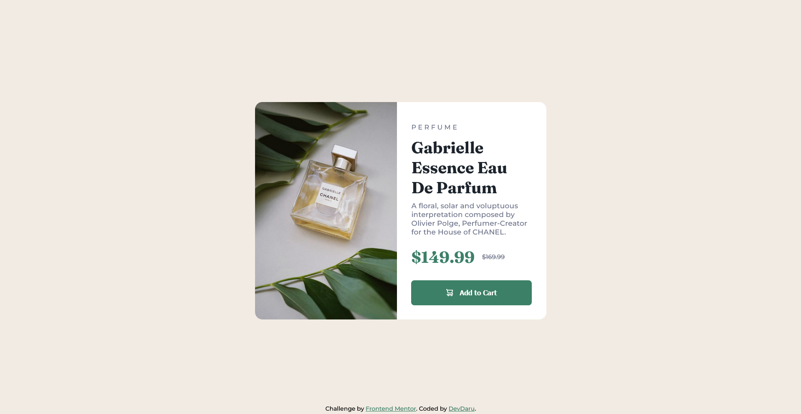

# Frontend Mentor - Product preview card component solution

This is a solution to the [Product preview card component challenge on Frontend Mentor](https://www.frontendmentor.io/challenges/product-preview-card-component-GO7UmttRfa).

## Table of contents

- [Overview](#overview)
  - [The challenge](#the-challenge)
  - [Screenshot](#screenshot)
  - [Links](#links)
- [My process](#my-process)
  - [Built with](#built-with)
  - [What I learned](#what-i-learned)
  - [Useful resources](#useful-resources)
- [Author](#author)

## Overview

### The challenge

Users should be able to:

- View the optimal layout depending on their device's screen size
- See hover and focus states for interactive elements

### Screenshot

### Links

- Solution URL: [click here](https://github.com/DevvMarko/product-preview-card)
- Live Site URL: [click here](https://devvmarko.github.io/product-preview-card/)

## My process

### Built with

- Semantic HTML5 markup
- CSS custom properties
- Flexbox
- Mobile-first workflow

### What I learned

I've become more familiar with media queries from project to project, and I've also learned what breakpoints work best for certain devices. That's very helpful.

### Useful resources

- [Media Queries Breakpoints](https://www.w3schools.com/css/css_rwd_mediaqueries.asp) - This helped me figure out what minimum layout width I should set depending on my screen size.

## Author
- Frontend Mentor - [@DevDaru](https://www.frontendmentor.io/profile/DevvMarko)